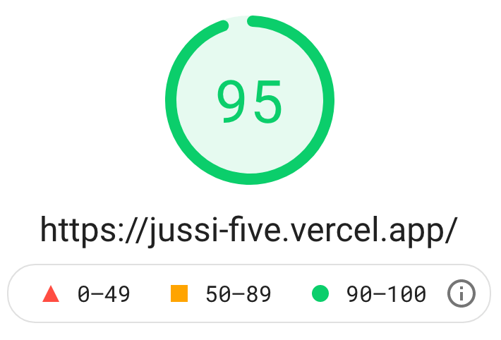
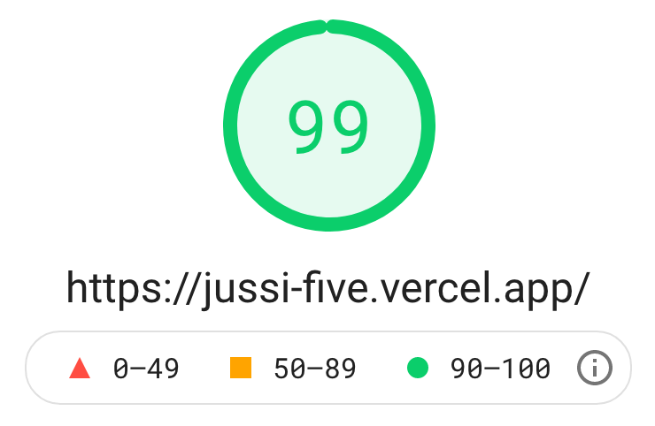

<div align="center">
  

  Visit [jussi-five.vercel.app](https://jussi-five.vercel.app/) our run locally.
</div>

<br>

## Overview
Project using [Next.js](https://nextjs.org/) - The React Framework for Production

## Locally Started
Runs next dev which starts Next.js in development mode. Please run:

```bash
yarn install
yarn dev
```
The application always starts on port 3000. To change the port, use:

```bash
yarn dev -p {port}
```

## Technology
- [React JS](https://pt-br.reactjs.org/)
- [Next JS](https://nextjs.org/)
- [Styled Components](http://styled-components.com/)
- [Polished](https://polished.js.org/)
- [Toastify](https://fkhadra.github.io/react-toastify/introduction/)

## Performance

|Mobile|Desktop|
|:-------------:|:-------------:|
|||

## License

MIT © [BrunoEsposito](https://github.com/brunoesposito)